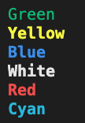

# Movie Hangman

Movie Hangman, is an interactive terminal game which allows the user to play hangman in a retro arcade game style. Four different modes are available which include - Disney, Comedy, SciFi, and Horror. Each one generates a random movie from a list of movies from that genre. This is to open the game up to a wider selection of movie fans. 

The targetted audience is all who have a love of word games and movies.

To access the game please follow this link [Movie Hangman!](https://movie-hangman.herokuapp.com/)  
Project Repository - [Movie Hangman - Repository](https://github.com/NDOMINEY/movie-hangman)

## Table of Contents
+ [Requirements](#requirements "Requirements")
+ [Design](#design "Design")
  + [Flow Diagram](#flow-diagram "Flow Diagram")
  + [Wireframes](#wireframes "Wireframes")
  + [Colour Scheme](#colour-scheme "Colour Scheme")
  + [Typography](#typography "Typography")
+ [Features](#features "Features")
  + [Existing Features](#existing-features "Existing Features")
+ [Testing](#testing "Testing")
  + [Development Process](#development-process "Development Process")
  + [Usability Testing](#usability-testing "Usability Testing")
  + [User Requirement Testing](#user-requirement-testing "User Requirement Testing")
  + [Functional Testing](#functional-testing "Functional Testing")
  + [Validator Testing](#validator-testing "Validator Testing")
  + [Unfixed Bugs](#unfixed-bugs "Unfixed Bugs")
+ [Technologies Used](#technologies-used "Technologies Used")
  + [Main Languages Used](#main-languages-used "Main Languages Used")
+ [Deployment](#deployment "Deployment")
+ [Credits](#credits "Credits")
  + [Content](#content "Content")
  + [Media](#media "Media")

## Requirements

Please see below a table showing the desired requirements for Movie Hangman game, with a matrix for importance of feature and feasibility of implementation.

|   Requirement                                                                               |   Importance  |   Viability/Feasibility  |
|------------------------------------------------------------------------------------------------|------------------|-----------------------------|
|   Display the game in a retro arcade fashion with the use of fonts and colours in terminal  |   5           |   5                      |
|   Provide the user with random selection of a movie title to play hangman                   |   5           |   5                      |
|   Provide the user with a choice of movie genres to select the movie title from             |   5           |   5                      |
|   Enable the user to play multiple games without restarting the program each time           |   5           |   5                      |
|   Create a measurement of how well the puzzle was solved                                    |   4           |   4                      |
|   Use the measurement to create and store a record of a score with user input of name       |   3           |   3                      |
|   Display top high scores to user                                                           |   3           |   3                      |

## Design

### Flow Diagram:
To structure the game and aid in creating the functions required to run the game a basic flow diagram was created which is linked below.

[Flow Diagram](documentation/game-flowchart.pdf)

### Wireframes:

Please see below link to wireframes for the game layout.

[Wireframes](documentation/wireframes.pdf)

### Colour Scheme:

To keep with the retro arcade theme, the majority of the colors chosen for text is bold primary colours with a couple of secondary colours for variety.

### Typography:

To create a retro feel to the game, the title and main information communicated to the user was done using Ascii art for the words and the hangman illustration. 

To generate the Ascii art for the words, the below generator was used with the following font options.

[Ascii Generator](https://ascii-generator.site/t/)

- Title font used was 'dancingfont'
- All other Ascii font 'small'

## Features

### Existing Features

#### Introduction

When the program first runs, a large game title is displayed to convery to the user the purpose of the program is a Hangman game. The title is then followed by the rules of the game to the user.

#### Movie Genre Selection

To enable to the user to narrow down the movie title to a genre of their choice, they are presented with four options which they are able to select from.  
The four options are Disney, Comedy, SciFi, and Horror.

#### Game Play

When the game is in progress, at the top a hangman illustration is displayed with the total amount of lives left. Incorrect guesses are displayed below so that the user is aware.

Below this, the movie title they are guessing is displayed with '_' for letters yet to be guessed. This is then followed by a user input request for their next guess.

Please see link below to all stages of the hangman illustrations.

[Hangman Illustrations](documentation/ascii-hangman.pdf)

#### Game Over

When the user runs out of lives, a final hangman illustration is shown to inform the user the game is over. The user is then informed on what the title of the movie was and given the option to play again.

#### Movie Title Guessed

When the user corrects the whole movie title correctly, the below is displayed to the user to let them know they guessed it correctly.

#### Timed Score

To measure a score against how well the user did, the game play is timed and if the user wins this is displayed to them. The user is then asked to submit their name to record against their time.

After this, a top 10 scores are displayed to the user to see if they made the top list.

The user is then given the option to play again.

### Future Features

The addition of difficulty levels

- Easy - with no restriction of lives
- Medium - standard amount of lives
- Hard - reduced lives
- Extreme - reduced lives and time to complete

## Testing

### Development Process

### Usability Testing

### User Requirement Testing

### Functional Testing

### Validator Testing

### Unfixed Bugs

## Technologies Used

### Main Languages Used
- Python

## Deployment
This site is deployed through GitHub Pages. The following steps where followed -
- Within the repository, go to settings
- Under settings select pages section
- Select source 'Deploy from a branch'
- Underneath source, select main branch and root folder and save to deploy

#### Future development

## Credits

### Content

### Media